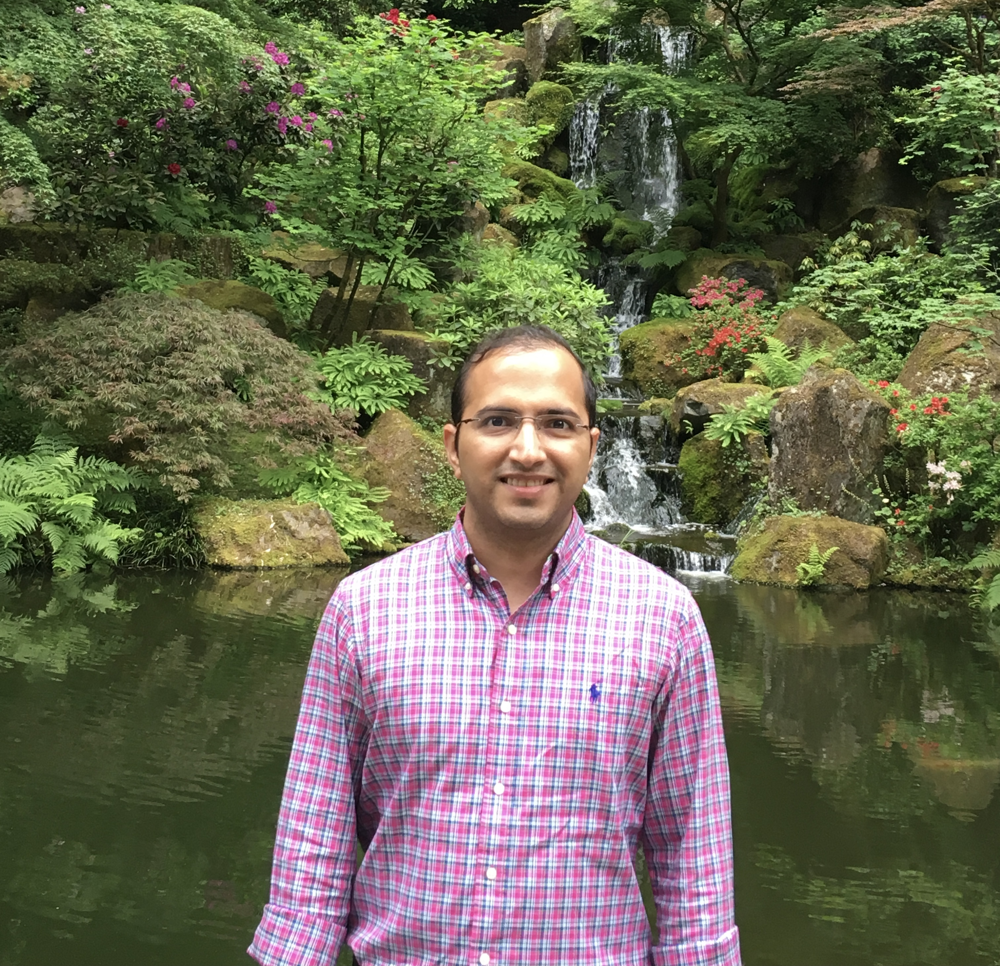

## Short Bio
 

I am a Data Scientist wherein I build and deploy machine learning based solutions to interesting problems. My work has centered around problems in online-advertising, marketing and operational forecasting. As part of solution, I employ Deep learning (RNNs, CNNs), NLP and ML techniques along with cloud frameworks for deployment. Some of the problems I have worked on are ad-impression predictions, attribution, anomaly detection, causal inference and personalization in digital marketing. The engineering side of my work involves writiing code to deploy models to production, working with various cloud frameworks and building ML platforms. 

Previously, I obtained a PhD in Mathematics. Specifically, I worked in Index theory (out of [Atiyah-Singer Index theorem](https://en.wikipedia.org/wiki/Atiyah%E2%80%93Singer_index_theorem)) which, briefly speaking, explores the interplay between analysis and topology. An excellent example of this relationship is [Gauss-Bonnet theorem](https://en.wikipedia.org/wiki/Gauss%E2%80%93Bonnet_theorem). In addition, I have also worked in Riemannian geometry and smooth dynamical systems. Both of the areas involve solving (class of)partial differential equations over a space with rich geometry. 

In general, I maintain a strong interest in problems involving rich geometry. In machine learning, its fascinating to see applications of geometric techniques in areas of Topological data analysis, Geometric deep learning (Graph Convolution Networks, manifold learning) and and Knowledge graphs. 

## Contact
- Email: k{mylastname}.math@gmail.com
- [LinkedIn](https://www.linkedin.com/in/kunalsharma13/) 
- [GitHub](https://github.com/kunalrsharma/)

## Publications & Research interests
- Stochastic approach to anomaly detection in large networks with edge attributes, Working. 
- [Adiabatic limit of Calderon projector on manifold with cylindrical end](https://drive.google.com/file/d/1_rVddyiNyt9xT8dd3h7oyaj9SK0t_qEH/view?usp=sharing)
- [Bounding topological entropy of geodesic flows of $$C^{(1, \alpha)}$$ Riemannian metric](https://drive.google.com/file/d/1Lbmt6jq3KHRCDvxXER8QVZTA7I2BBylo/view?usp=sharing)

### Research Interests
Machine learning/Deep learning on graphs (GNN,GCN etc) and its applications to Knowledge graphs, Anomaly detection and Spectral techniques. 

Feel free to reach out to me if these topics interest you and would like to explore a problem together.

## Expository writings
- [Spark:An overview](Spark-an overview.pptx) A summary of of Spark's working based on my reading and professinal experience with it. (I took the liberty of borrowing pictures)  
<!-- - [Graph Neural Networks](Graph-Neural-Networks.md) -->
- [Topological analysis & Robotics](https://drive.google.com/file/d/1-P6EM6pJ-9WikEh7FXdLtDUC7U9JKKpQ/view?usp=sharing) This is a short note on interesting topological results, and outline of ideas in Robotics:The ideas on Robotics grew out my interest in studying the topology of configuration spaces of "mechanical" or "factory" robots. Working jointly with [Paul Loya](http://people.math.binghamton.edu/loya/) we found new examples of configuration spaces with rich topology. However, this project wasn't taken much further due to my developing interest in machine learning. Nevertheless, robotics continues to benefit greatly by borrowing ideas from Topology. 

## Graph Neural Network papers
There are several approaches to GNNs but I focus here on spectral approaches, especially in GCNs. 
- [Relatively early paper on GNN applying fixed point theorems](https://persagen.com/files/misc/scarselli2009graph.pdf), [Good overview](https://arxiv.org/pdf/1901.00596.pdf), 
- **Graph Convolution networks**: [Spectral approach by Bruna et al](https://arxiv.org/pdf/1312.6203.pdf), [GCN w/ Chebyshev polynomial approach](https://arxiv.org/pdf/1609.02907.pdf) and [Graph Wavelet network](https://arxiv.org/abs/1904.07785) which replaces the Fourier transform with Wavelet transform to extend spectral GCNs.  
